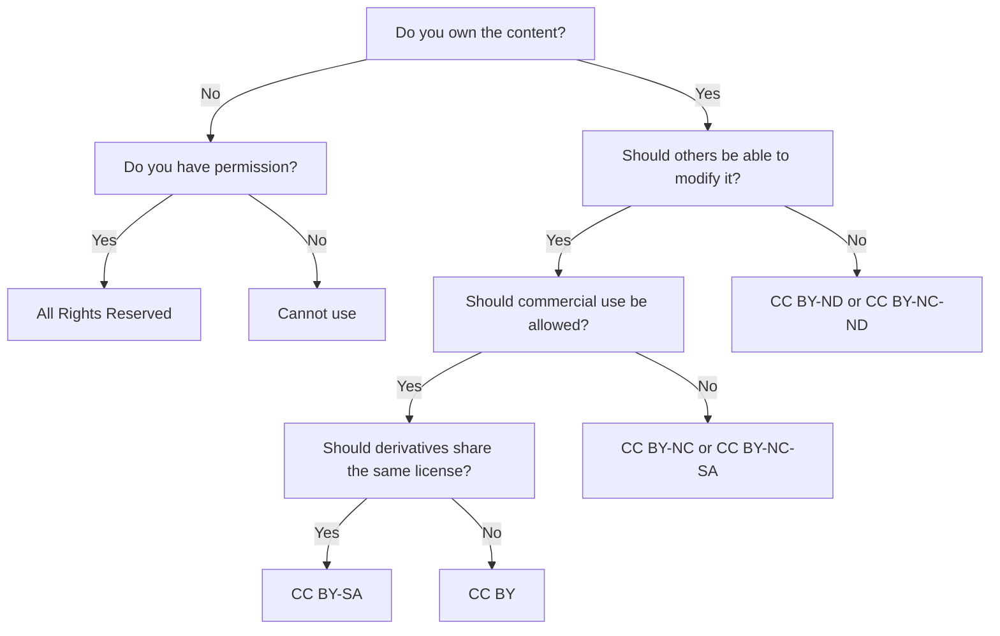

Proper licensing is essential for legally sharing educational content. Kolibri Studio supports multiple license types and enforces attribution requirements to ensure content is distributed according to copyright law.

## Supported licenses

The licenses are defined in `le_utils.constants.licenses` and stored in the database via the `License` model (`models.py:1779`):

```python
class License(models.Model):
    license_name = models.CharField(max_length=50)
    license_url = models.URLField(blank=True)
    license_description = models.TextField(blank=True)
    copyright_holder_required = models.BooleanField(default=True)
    is_custom = models.BooleanField(default=False)
    exists = models.BooleanField(default=False)
```

### License list

From `Licenses.js`, the following licenses are supported:

## Creative Commons licenses

### CC BY

```json
{
  "id": 1,
  "license_name": "CC BY",
  "license_url": "https://creativecommons.org/licenses/by/4.0/",
  "copyright_holder_required": true
}
```

**Attribution Required**

- ✅ Commercial use allowed
- ✅ Derivatives allowed
- ✅ Adaptations may use different license
- ✅ Must credit original author

**Use when:** Content can be freely used, modified, and shared with attribution.

### CC BY-SA

```json
{
  "id": 2,
  "license_name": "CC BY-SA",
  "license_url": "https://creativecommons.org/licenses/by-sa/4.0/",
  "copyright_holder_required": true
}
```

**Attribution-ShareAlike**

- ✅ Commercial use allowed
- ✅ Derivatives allowed
- ⚠️ Derivatives must use same license
- ✅ Must credit original author

**Use when:** Content can be modified but derivatives must maintain the same license (copyleft).

### CC BY-ND

```json
{
  "id": 3,
  "license_name": "CC BY-ND",
  "license_url": "https://creativecommons.org/licenses/by-nd/4.0/",
  "copyright_holder_required": true
}
```

**Attribution-NoDerivatives**

- ✅ Commercial use allowed
- ❌ No derivatives allowed
- ✅ Must credit original author

**Use when:** Content can be shared but not modified.

### CC BY-NC

```json
{
  "id": 4,
  "license_name": "CC BY-NC",
  "license_url": "https://creativecommons.org/licenses/by-nc/4.0/",
  "copyright_holder_required": true
}
```

**Attribution-NonCommercial**

- ❌ No commercial use
- ✅ Derivatives allowed
- ✅ Adaptations may use different license
- ✅ Must credit original author

**Use when:** Content is free for educational use but not commercial purposes.

### CC BY-NC-SA

```json
{
  "id": 5,
  "license_name": "CC BY-NC-SA",
  "license_url": "https://creativecommons.org/licenses/by-nc-sa/4.0/",
  "copyright_holder_required": true
}
```

**Attribution-NonCommercial-ShareAlike**

- ❌ No commercial use
- ✅ Derivatives allowed
- ⚠️ Derivatives must use same license
- ✅ Must credit original author

**Use when:** Non-commercial educational content that requires derivative works to maintain the same license.

### CC BY-NC-ND

```json
{
  "id": 6,
  "license_name": "CC BY-NC-ND",
  "license_url": "https://creativecommons.org/licenses/by-nc-nd/4.0/",
  "copyright_holder_required": true
}
```

**Attribution-NonCommercial-NoDerivatives**

- ❌ No commercial use
- ❌ No derivatives allowed
- ✅ Must credit original author

**Use when:** Content can only be shared as-is for non-commercial purposes.

## Other licenses

### Public Domain

```json
{
  "id": 8,
  "license_name": "Public Domain",
  "license_url": "https://creativecommons.org/publicdomain/mark/1.0/",
  "copyright_holder_required": false
}
```

- ✅ No restrictions
- ✅ No attribution required
- ✅ Commercial use allowed
- ✅ Derivatives allowed

**Use when:** Content has no copyright restrictions (very old works, government content, or explicitly released).

<Warning>
Only use Public Domain for content that is definitively in the public domain. Don't use this as a default.
</Warning>

### All Rights Reserved

```json
{
  "id": 7,
  "license_name": "All Rights Reserved",
  "license_url": "http://www.allrights-reserved.com/",
  "copyright_holder_required": true
}
```

- ❌ No redistribution without permission
- ❌ No derivatives
- ❌ No commercial use

**Use when:** You have explicit permission to use copyrighted content but it cannot be freely redistributed.

<Info>
All Rights Reserved content can be in your private channels but should be used carefully in public channels.
</Info>

### Special Permissions

```json
{
  "id": 9,
  "license_name": "Special Permissions",
  "copyright_holder_required": true,
  "is_custom": true,
  "exists": false
}
```

Used for content with custom licensing agreements.

## License on content nodes

Licenses are assigned to individual content nodes:

```python
class ContentNode(MPTTModel, models.Model):
    license = models.ForeignKey(
        "License", 
        null=True, 
        blank=True, 
        on_delete=models.SET_NULL
    )
    license_description = models.CharField(
        max_length=400, 
        null=True, 
        blank=True
    )
    copyright_holder = models.CharField(
        max_length=200,
        null=True,
        help_text="Organization or person who holds the essential rights"
    )
```

## Attribution requirements

Most licenses require attribution. The `copyright_holder_required` field enforces this:

```python
license.copyright_holder_required  # True for most licenses
```

When this is `True`, you must provide:

1. **Copyright holder** - The person or organization that created the content
2. **Author** (optional) - The creator of the content
3. **Provider** (optional) - Who distributed the content
4. **Aggregator** (optional) - Who collected the content

These fields are stored on the content node:

```python
author = models.CharField(max_length=200, blank=True)
aggregator = models.CharField(max_length=200, blank=True)
provider = models.CharField(max_length=200, blank=True)
```

## License inheritance

Channels have default license settings in `content_defaults`:

```python
DEFAULT_CONTENT_DEFAULTS = {
    "license": None,
    "author": None,
    "aggregator": None,
    "provider": None,
    "copyright_holder": None,
    "license_description": None,
    # ...
}
```

These defaults are applied to new content nodes, but each node can override them.

## License validation

The `License` model includes validation (`models.py:1796`):

```python
@classmethod
def validate_name(cls, name):
    if cls.objects.filter(license_name=name).count() == 0:
        raise ValidationError("License `{}` does not exist".format(name))
```

## Channel version license tracking

When a channel is published, license information is aggregated in `ChannelVersion`:

```python
class ChannelVersion(models.Model):
    included_licenses = ArrayField(
        models.IntegerField(choices=get_license_choices()),
        null=True,
        blank=True,
    )
    non_distributable_licenses_included = ArrayField(
        models.IntegerField(choices=get_license_choices()),
        null=True,
        blank=True,
    )
```

This allows users to see what licenses are present in a channel before importing it.

## Choosing a license

<Steps>
  <Step title="Determine your rights">
    Do you own the copyright to this content? Do you have permission to share it?
  </Step>
  <Step title="Consider your goals">
    - Do you want others to be able to modify your content?
    - Should commercial use be allowed?
    - Do derivatives need to use the same license?
  </Step>
  <Step title="Select the appropriate license">
    Use the most permissive license that aligns with your goals. CC BY or CC BY-SA are common for open educational resources.
  </Step>
  <Step title="Provide attribution">
    Fill in the copyright holder and other attribution fields as required by the license.
  </Step>
</Steps>

## License decision tree



## Best practices

<AccordionGroup>
  <Accordion title="For open educational resources">
    Use **CC BY** or **CC BY-SA** to maximize reusability and remix potential.
  </Accordion>
  
  <Accordion title="For institutional content">
    Use **CC BY-NC-SA** if you want to prevent commercial use while allowing educational adaptations.
  </Accordion>
  
  <Accordion title="When in doubt">
    Choose a more restrictive license initially. You can always relax restrictions later, but you cannot add restrictions to content already shared.
  </Accordion>
  
  <Accordion title="For mixed content">
    If combining content with different licenses, use the most restrictive compatible license. For example, combining CC BY and CC BY-SA requires using CC BY-SA for the result.
  </Accordion>
</AccordionGroup>

<Warning>
**License compatibility matters**

When remixing content:
- CC BY-SA content requires derivatives to also be CC BY-SA
- NC (NonCommercial) licenses cannot be mixed with commercial licenses
- ND (NoDerivatives) content cannot be modified at all
</Warning>

## Related concepts

- [Content nodes](/concepts/content-nodes) - Where licenses are applied
- [Channels](/concepts/channels) - Default license settings
- [Publishing](/guide/publishing) - License information in published channels

## External resources

- [Creative Commons License Chooser](https://creativecommons.org/choose/)
- [CC License Compatibility Chart](https://wiki.creativecommons.org/wiki/Wiki/cc_license_compatibility)
- [Open Educational Resources](https://www.unesco.org/en/open-educational-resources)

## Next steps

<CardGroup cols={2}>
  <Card title="Creating channels" icon="plus" href="/guide/creating-channels">
    Learn how to set default licenses for your channel
  </Card>
  <Card title="Content types" icon="shapes" href="/concepts/content-types">
    Understand the different types of content you can license
  </Card>
</CardGroup>