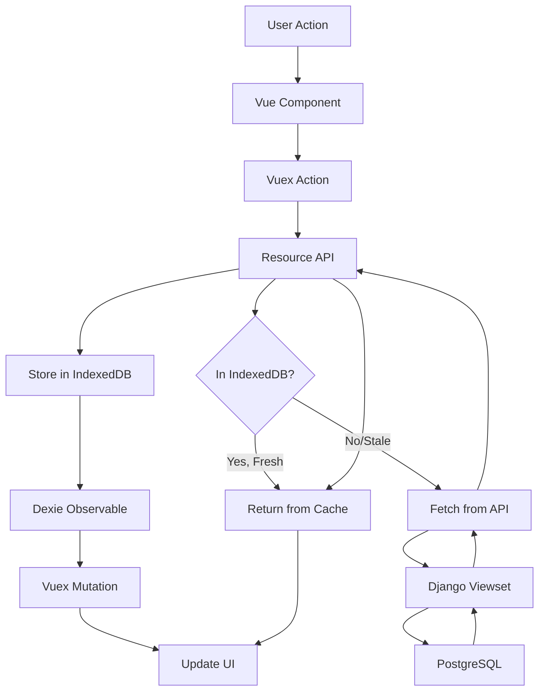

Kolibri Studio uses **Django** for the backend and **Vue.js** for the frontend, with a sophisticated sync mechanism for offline-first editing.

## Tech Stack

<CardGroup cols={2}>
  <Card title="Backend" icon="server">
    - Django 1.11
    - Django REST Framework
    - PostgreSQL
    - Celery for async tasks
  </Card>
  <Card title="Frontend" icon="code">
    - Vue.js 2.7
    - Vuex for state management
    - Vue Router
    - IndexedDB with Dexie.js
  </Card>
</CardGroup>

## Frontend Architecture

### Multiple Single-Page Applications

Studio is divided into multiple SPAs, each with a distinct purpose:

| SPA | Purpose |
|-----|----------|
| **Channel List** | Display and manage channels (public, editable), create channels and collections |
| **Channel Edit** | Edit channel contents and structure - the primary Studio interface |
| **Accounts** | User registration, login, password recovery |
| **Administration** | Staff-only admin panel for user and channel management |
| **Settings** | User account settings |

### Frontend Code Structure

All frontend code lives under `contentcuration/contentcuration/frontend/`:

```
frontend/
├── channelList/          # Channel listing SPA
├── channelEdit/          # Channel editor SPA (main interface)
├── accounts/             # Authentication SPA
├── administration/       # Admin SPA
├── settings/             # Settings SPA
└── shared/               # Shared code across SPAs
    ├── data/             # Data resources and IndexedDB
    ├── vuex/             # Shared Vuex modules
    ├── components/       # Shared components
    └── utils/            # Utilities
```

### SPA Code Conventions

Each SPA follows these conventions:

```
<spaName>/
├── index.js              # Vue app initialization
├── router.js             # Vue Router routes
├── store.js              # Vuex store initialization
├── pages/                # Route components
├── components/           # Shared components within SPA
├── vuex/                 # Vuex modules
└── __tests__/            # Jest tests
```

<Tip>
  Use the Webpack alias `shared/...` to import shared code across SPAs.
</Tip>

## Backend Architecture

### Django Structure

The backend uses Django with custom viewsets and serializers:

```
contentcuration/contentcuration/
├── models.py             # Django models
├── viewsets/             # DRF viewsets
│   ├── base.py           # Base viewset classes
│   ├── channel.py        # Channel viewsets
│   ├── contentnode.py    # Content node viewsets
│   ├── assessmentitem.py # Assessment viewsets
│   └── sync/             # Sync endpoint
└── tests/                # Python tests
```

### Custom Base Classes

Studio uses custom DRF base classes for performance:

<Accordion title="ValuesViewset">
  Located in `viewsets/base.py`, this viewset optimizes read performance by:

  - Using `.values()` queries instead of serializer reads
  - Defining a `values` tuple for fields to return
  - Using `field_map` to rename/transform fields
  - Supporting custom methods: `get_queryset`, `prefetch_queryset`, `annotate_queryset`, `consolidate`

  Example:

  ```python
  class ContentNodeViewset(ValuesViewset):
      values = ('id', 'title', 'description', 'kind_id')
      field_map = {
          'kind': 'kind_id',  # Rename kind_id to kind
      }
  ```
</Accordion>

<Accordion title="BulkModelSerializer">
  Located in `viewsets/base.py`, this serializer enables bulk operations:

  - `bulk_create` - Create multiple instances
  - `bulk_update` - Update multiple instances
  - `bulk_delete` - Delete multiple instances
  - Tracks changes via `self.changes` list

  Example:

  ```python
  class ChannelSerializer(BulkModelSerializer):
      class Meta:
          model = Channel
          list_serializer_class = BulkListSerializer
  ```
</Accordion>

## Data Flow

### Read Flow

<Steps>
  <Step title="Frontend requests data">
    Vue component or Vuex action requests data via Resource API:

    ```javascript
    import { Channel } from 'shared/data/resources';

    const channels = await Channel.where({ public: true });
    ```
  </Step>

  <Step title="Check IndexedDB cache">
    Resource API checks IndexedDB for cached data. If found and fresh (< 5 seconds old), returns immediately.
  </Step>

  <Step title="Fetch from backend">
    If stale or missing, fetch from Django REST endpoint:

    ```
    GET /api/channels/?public=true
    ```
  </Step>

  <Step title="Store in IndexedDB">
    Response is stored in IndexedDB and returned to caller.
  </Step>

  <Step title="Update Vuex store">
    Dexie Observable triggers Vuex mutations via listeners to update UI state.
  </Step>
</Steps>

### Write Flow

<Steps>
  <Step title="User edits data">
    User makes changes in the UI (e.g., edit content node title).
  </Step>

  <Step title="Update IndexedDB">
    Resource API updates IndexedDB:

    ```javascript
    await ContentNode.update(nodeId, { title: 'New Title' });
    ```
  </Step>

  <Step title="Track change">
    Dexie Observable captures the change event automatically.
  </Step>

  <Step title="Debounced sync">
    A debounced sync function in `frontend/shared/data/serverSync.js` batches changes.
  </Step>

  <Step title="POST to sync endpoint">
    Changes are posted to `/api/sync/`:

    ```json
    {
      "changes": [
        {
          "table": "contentnode",
          "type": "UPDATED",
          "key": "abc123",
          "obj": { "title": "New Title" }
        }
      ]
    }
    ```
  </Step>

  <Step title="Backend validates and applies">
    The sync endpoint validates changes and calls appropriate viewset methods (`bulk_update`, `bulk_create`, etc.).
  </Step>

  <Step title="Return updates to frontend">
    Server sends back any additional changes (e.g., updated timestamps) for IndexedDB.
  </Step>
</Steps>

### Sync Mechanism

The sync system enables offline-first editing:

<Tabs>
  <Tab title="Change Types">
    Four change types are tracked:

    ```python
    # From viewsets/sync/constants.py
    CREATED = 1
    UPDATED = 2
    DELETED = 3
    MOVED = 4
    ```
  </Tab>

  <Tab title="Sync Endpoint">
    The sync endpoint (`viewsets/sync/endpoint.py`) maps frontend tables to backend viewsets:

    ```python
    SYNC_MODELS = OrderedDict([
        ('contentnode', ContentNodeViewset),
        ('channel', ChannelViewset),
        ('assessmentitem', AssessmentItemViewset),
        # ...
    ])
    ```
  </Tab>

  <Tab title="Conflict Resolution">
    Changes are validated before applying. Invalid changes are rejected and returned as errors.
  </Tab>
</Tabs>

## IndexedDB Resources

Frontend data is persisted in IndexedDB tables managed by Dexie.js.

### Resource API

Resources are defined in `frontend/shared/data/resources.js`:

```javascript
import { Resource } from 'shared/data/resources';

const Channel = new Resource({
  tableName: 'channel',
  urlName: 'channel',  // Matches DRF base_name
  idField: 'id',
  indexFields: ['public', 'edit'],  // IndexedDB indexes
  uuid: true,  // Generate UUIDs for new entries
  syncable: true,  // Sync changes to backend
});
```

### Common Resources

| Resource | Table | Purpose |
|----------|-------|----------|
| `Channel` | `channel` | Channel metadata |
| `ContentNode` | `contentnode` | Content items in tree |
| `File` | `file` | File metadata |
| `AssessmentItem` | `assessmentitem` | Exercise questions |
| `User` | `user` | User information |

## Vuex Integration

Vuex stores listen to IndexedDB changes via Dexie Observable:

```javascript
// frontend/channelEdit/vuex/contentNode/index.js
export default {
  namespaced: true,
  state: () => ({
    contentNodesMap: {},
  }),
  mutations: {
    ADD_CONTENTNODE(state, node) {
      state.contentNodesMap[node.id] = node;
    },
  },
  listeners: {
    [TABLE_NAMES.CONTENTNODE]: {
      [CHANGE_TYPES.CREATED]: 'ADD_CONTENTNODE',
      [CHANGE_TYPES.UPDATED]: 'ADD_CONTENTNODE',
    },
  },
};
```

When IndexedDB changes, registered mutations fire automatically to update UI.

## Data Flow Diagram



## Key Technologies

<CardGroup cols={2}>
  <Card title="Dexie.js" icon="database" href="https://dexie.org/">
    IndexedDB wrapper for client-side storage
  </Card>
  <Card title="Dexie Observable" icon="bell" href="https://dexie.org/docs/Observable/Dexie.Observable">
    Track IndexedDB changes automatically
  </Card>
  <Card title="Django REST Framework" icon="python" href="https://www.django-rest-framework.org/">
    REST API framework for Django
  </Card>
  <Card title="Celery" icon="tasks" href="https://docs.celeryproject.org/">
    Distributed task queue for async operations
  </Card>
</CardGroup>

## Next Steps

<CardGroup cols={2}>
  <Card title="Frontend Development" icon="vuejs" href="/development/frontend">
    Build Vue.js components and Vuex modules
  </Card>
  <Card title="Backend Development" icon="python" href="/development/backend">
    Create Django models and viewsets
  </Card>
</CardGroup>
