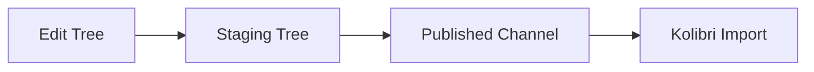

Publishing is the process of packaging your channel so it can be imported into Kolibri for offline use. Once published, channels are distributed to Kolibri installations worldwide.

## Publishing workflow

Studio uses a three-stage workflow to ensure content quality:

### 1. Edit tree (draft)

When you create or modify content in Studio, changes are saved to the **edit tree**. This is your working draft:

- Changes are saved locally in IndexedDB
- Synced to the server periodically
- Not visible to Kolibri users
- Can be edited by all collaborators with edit access

### 2. Staging tree (preview)

Before publishing, you can review changes in the **staging tree**:

- A snapshot of your edit tree at a specific point in time
- Allows you to preview what will be published
- Can be used for internal review before going live

<Info>
  The staging tree is optional. You can publish directly from the edit tree if you don't need a review step.
</Info>

### 3. Published channel (production)

Publishing creates a versioned release that Kolibri can import:

- Immutable once published (edits require a new version)
- Assigned a version number
- Available for import into Kolibri
- Cached and distributed through CDN

## How to publish a channel

<Steps>
  <Step title="Review your content">
    Before publishing, review your channel:
    - Check all topics and resources
    - Ensure metadata is complete (titles, descriptions, licenses)
    - Verify file uploads are correct
    - Test any exercises
    
    <Tip>
      Use the **Preview** mode to see your channel as learners will experience it in Kolibri.
    </Tip>
  </Step>
  <Step title="Click Publish">
    In the top-right corner of the channel editor, click the **Publish** button.
  </Step>
  <Step title="Add version information">
    Provide details about this version:
    - **Version description**: Describe what's new or changed (e.g., "Added Grade 6 geometry unit", "Fixed broken video links")
    - **Version notes**: Optional detailed notes for your team
  </Step>
  <Step title="Start publishing">
    Click **Publish Channel** to begin the process.
    
    Studio will:
    - Validate all content nodes
    - Generate thumbnail images
    - Calculate file sizes
    - Create database export
    - Update the channel metadata
  </Step>
  <Step title="Wait for completion">
    Publishing can take several minutes to hours depending on:
    - Channel size (number of files)
    - Total file size (especially large videos)
    - Server load
    
    <Warning>
      **Do not close your browser** until publishing completes. If you navigate away, the process may fail.
    </Warning>
  </Step>
  <Step title="Get your channel token">
    After publishing, you'll receive a **channel token** (unique identifier). Share this with Kolibri users so they can import your channel.
    
    Example token: `1ceff53d14ad5f72bc573db52f8c09cf`
  </Step>
</Steps>

## Channel versioning

Each time you publish, Studio creates a new **version** of your channel.

### Version numbers

Versions are numbered sequentially starting from 1:

- Version 1: Initial publish
- Version 2: First update
- Version 3: Second update
- ...

### Version history

You can view previous versions:

1. Open your channel
2. Click **Channel** → **Version history**
3. See all published versions with timestamps and descriptions

### Kolibri updates

When you publish a new version:

- Existing Kolibri installations see an **update available** notification
- Admins can choose to update the channel
- Kolibri downloads only the changed files (not the entire channel again)

<Info>
  Kolibri checks for updates periodically (typically daily). Users won't see updates immediately after you publish.
</Info>

## Public vs. private channels

### Making a channel public

<Steps>
  <Step title="Open channel settings">
    Go to **Channel** → **Settings**.
  </Step>
  <Step title="Enable public visibility">
    Check the box for **Make channel public**.
  </Step>
  <Step title="Save settings">
    Click **Save** to apply the change.
  </Step>
</Steps>

**Public channels**:
- Appear in Studio's public library
- Listed in Kolibri's channel browser
- Discoverable by anyone
- Searchable by name, description, and tags

**Private (unlisted) channels**:
- Only accessible via channel token
- Not listed in public directories
- Only visible to collaborators in Studio
- Suitable for school-specific or proprietary content

<Tip>
  You can change visibility at any time. Making a channel private after it's been public doesn't remove it from Kolibri installations that already imported it.
</Tip>

## Channel tokens

Every channel has a unique **token** (32-character hex string) used for importing into Kolibri.

### Finding your token

1. Open your channel in Studio
2. Click **Channel** → **Settings**
3. Look for **Channel token** or **Channel ID**

Example: `a1b2c3d4e5f6789012345678901234ab`

### Using tokens in Kolibri

To import a private channel in Kolibri:

1. Go to **Device** → **Channels**
2. Click **Import from Studio**
3. Select **Import from token**
4. Enter the channel token
5. Proceed with import

Public channels can be found by searching by name, so the token isn't required.

## Unpublishing channels

You cannot "unpublish" a channel once it's published. However, you can:

### Make it private

- Change visibility to private in channel settings
- The channel won't appear in public listings
- Existing Kolibri installations keep their imported copies

### Delete the channel

- Deletes the channel from Studio
- Existing Kolibri installations keep their copies (but won't receive updates)
- Cannot be undone

<Warning>
  There's no way to remotely remove a channel from Kolibri after users have imported it. Kolibri admins must manually delete it from their installations.
</Warning>

## Troubleshooting

### Publishing fails

**Possible causes**:
- Missing required metadata (title, license)
- File upload errors (corrupted or incomplete files)
- Server timeout for very large channels
- Network connectivity issues

**Solutions**:
- Check all content nodes for missing metadata
- Re-upload any files that failed
- For large channels, publish during off-peak hours
- Contact support if the issue persists

### Publishing takes too long

**Expected times**:
- Small channels (< 100 MB): 1-5 minutes
- Medium channels (100 MB - 1 GB): 5-30 minutes
- Large channels (> 1 GB): 30 minutes - several hours

**Tips for faster publishing**:
- Compress large video files before uploading
- Remove duplicate or unused content
- Publish during off-peak hours (avoid weekdays 9am-5pm UTC)

### Channel not appearing in Kolibri

**For public channels**:
- Publishing can take 10-15 minutes to propagate
- Try refreshing the channel list in Kolibri
- Search by exact channel name

**For private channels**:
- Verify you're using the correct token
- Ensure the channel has been published (not just staged)
- Check that the Kolibri device has internet access

### Updates not showing in Kolibri

- Kolibri checks for updates periodically (typically daily)
- Admins can manually trigger an update check
- Only channels marked as **public** or previously imported via token can receive updates

## Best practices

### Before publishing

<Steps>
  <Step title="Complete metadata">
    Ensure every content node has:
    - Descriptive title
    - Clear description
    - Appropriate license
    - Relevant tags
  </Step>
  <Step title="Test content">
    - Play videos to ensure they work
    - Check PDFs open correctly
    - Test exercises for question accuracy
    - Verify subtitles sync with videos
  </Step>
  <Step title="Review structure">
    - Logical topic organization
    - Appropriate tree depth (2-4 levels)
    - No empty topics
    - Content ordered logically
  </Step>
  <Step title="Write version notes">
    Document what changed in this version for your team and users.
  </Step>
</Steps>

### Versioning strategy

- **Publish frequently**: Small, incremental updates are better than large, infrequent ones
- **Use clear version descriptions**: Help users understand what changed
- **Test before publishing**: Use the staging tree for internal review
- **Notify users**: Let your audience know when major updates are available

### Managing updates

- **Breaking changes**: If you restructure the channel significantly, consider creating a new channel instead of updating
- **Deprecation**: When retiring old content, clearly mark it in descriptions before removing
- **Communication**: Maintain a changelog or release notes document for your channel users

## Next steps

<CardGroup cols={2}>
  <Card title="Kolibri Integration" icon="download" href="/integrations/kolibri">
    Learn how Kolibri imports and updates channels
  </Card>
  <Card title="Channel Concepts" icon="book" href="/concepts/channels">
    Understand channel versioning and lifecycle
  </Card>
  <Card title="Collaboration" icon="users" href="/guide/collaboration">
    Work with teams to review content before publishing
  </Card>
  <Card title="Organizing Content" icon="sitemap" href="/guide/organizing-content">
    Optimize your channel structure for learners
  </Card>
</CardGroup>
