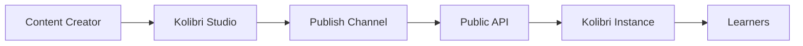

## Overview

Kolibri is a learning platform that imports educational content channels published on Kolibri Studio. This integration enables offline access to educational materials in low-connectivity environments.

<Info>
Kolibri Studio acts as the content creation and curation hub, while Kolibri serves as the distribution platform for learners.
</Info>

## Channel Distribution Flow



1. **Content Creation**: Educators create and organize content in Kolibri Studio
2. **Publishing**: Channels are published, making them exportable
3. **Discovery**: Kolibri queries the public API to discover available channels
4. **Import**: Kolibri downloads channel metadata and content
5. **Distribution**: Content is made available to learners offline

## Public API Endpoints

Kolibri uses versioned public API endpoints to discover and import channels.

### List All Public Channels

Retrieve all public channels available for import:

```http
GET /api/public/v1/channels
```

**Query Parameters:**
- `keyword` (optional): Search channels by name, description, or tags
- `language` (optional): Filter by language ID
- `tokens` (optional): Comma-separated list of channel tokens for private access

**Response:**
```json
[
  {
    "id": "a1b2c3d4e5f6g7h8i9j0",
    "name": "Khan Academy (English)",
    "language": "en",
    "included_languages": ["en", "es"],
    "description": "World-class education for anyone, anywhere",
    "total_resource_count": 5432,
    "version": 15,
    "kind_count": {
      "video": 3200,
      "exercise": 1800,
      "document": 432
    },
    "published_size": 15728640000,
    "last_published": "2024-03-15T10:30:00Z",
    "icon_encoding": "base64_encoded_icon",
    "matching_tokens": [],
    "public": true,
    "version_notes": {
      "1": "Initial release",
      "2": "Added new math content",
      "15": "Updated video quality"
    }
  }
]
```

**Field Descriptions:**
- `id`: Unique channel identifier (UUID)
- `name`: Channel display name
- `language`: Primary language code
- `included_languages`: All languages available in the channel
- `total_resource_count`: Total number of learning resources
- `version`: Current published version number
- `kind_count`: Breakdown of content by type (video, exercise, document, etc.)
- `published_size`: Total size in bytes
- `last_published`: Timestamp of last publication
- `icon_encoding`: Base64-encoded channel thumbnail
- `matching_tokens`: Channel tokens that match the request
- `public`: Whether the channel is publicly listed
- `version_notes`: Version history with release notes

### Channel Lookup by Identifier

Retrieve a specific channel by ID or token:

```http
GET /api/public/v1/channels/lookup/{identifier}
```

**Parameters:**
- `identifier`: Channel ID (UUID) or channel token

**Example:**
```http
GET /api/public/v1/channels/lookup/a1b2c3d4-e5f6-g7h8-i9j0-k1l2m3n4o5p6
```

Returns the same format as the channel list endpoint.

**Use Cases:**
- Checking if a private channel token is valid
- Getting updated metadata for a specific channel
- Verifying channel existence before import

### Get Channel Metadata

Retrieve basic channel information:

```http
GET /api/public/channel/{channel_id}
```

**Response:**
```json
{
  "name": "Khan Academy (English)",
  "description": "World-class education for anyone, anywhere",
  "version": 15
}
```

This lightweight endpoint is useful for quick channel information without full metadata.

## Content Node API

Kolibri also accesses detailed content metadata through the content node endpoints.

### List Channel Content

```http
GET /api/public/v1/contentnode
```

**Query Parameters:**
- `channel_id`: Filter by channel
- `kind`: Filter by content kind (video, exercise, topic, etc.)
- `parent`: Get children of a specific node
- `keywords`: Search content by keywords
- `languages`: Filter by language codes

**Response Format:**
```json
{
  "more": {
    "cursor": "next_page_token"
  },
  "results": [
    {
      "id": "node-uuid",
      "title": "Introduction to Algebra",
      "description": "Learn the basics of algebra",
      "kind": "video",
      "channel_id": "channel-uuid",
      "content_id": "content-uuid",
      "author": "Khan Academy",
      "license_name": "CC BY-NC-SA",
      "license_owner": "Khan Academy",
      "files": [
        {
          "id": "file-uuid",
          "checksum": "abc123def456",
          "extension": "mp4",
          "file_size": 52428800,
          "storage_url": "https://storage.url/abc123def456.mp4",
          "preset": "high_res_video"
        }
      ],
      "tags": ["algebra", "mathematics"],
      "learning_activities": ["watch", "practice"],
      "grade_levels": ["middle_school"],
      "duration": 420
    }
  ]
}
```

### Get Content Tree

Retrieve hierarchical content structure:

```http
GET /api/public/v1/contentnode_tree/{node_id}
```

**Query Parameters:**
- `depth`: Recursion depth (1 or 2)
- `next__gt`: Pagination token for next results

**Response:**
```json
{
  "id": "root-node-uuid",
  "title": "Mathematics",
  "kind": "topic",
  "children": {
    "results": [
      {
        "id": "child-node-uuid",
        "title": "Algebra",
        "kind": "topic",
        "children": {
          "results": [],
          "more": null
        }
      }
    ],
    "more": {
      "id": "root-node-uuid",
      "params": {
        "next__gt": 150,
        "depth": 2
      }
    }
  }
}
```

## Version Synchronization

Kolibri tracks channel versions to determine when updates are available.

### Version Checking

1. Kolibri stores the current `version` number for each imported channel
2. Periodically, Kolibri queries the public API for updated channel metadata
3. If the API returns a higher `version` number, an update is available
4. Users can choose to update to the new version

**Example Flow:**
```python
# Kolibri has version 14 installed
local_version = 14

# Query the API
response = get('/api/public/v1/channels/lookup/{channel_id}')
remote_version = response['version']  # Returns 15

# Update available
if remote_version > local_version:
    notify_user_of_update()
```

### Version Notes

The `version_notes` field provides a history of changes:

```json
{
  "version_notes": {
    "14": "Fixed broken video links",
    "15": "Added 200 new practice exercises"
  }
}
```

Kolibri can display this information to help users decide whether to update.

## Channel Import Process

### Step 1: Discovery

Kolibri discovers available channels through the public API:

```python
GET /api/public/v1/channels?language=en
```

### Step 2: Download Metadata

Kolibri downloads the complete content tree structure:

```python
GET /api/public/v1/contentnode?channel_id={channel_id}
```

### Step 3: Download Files

Kolibri downloads actual content files using the `storage_url` from the file metadata:

```json
{
  "storage_url": "https://studio.learningequality.org/content/storage/abc123.mp4"
}
```

Files are validated using the `checksum` field to ensure integrity.

### Step 4: Database Import

Kolibri creates its local database from the downloaded metadata, making content available offline.

## Private Channels

Channels can be made private using secret tokens.

### Accessing Private Channels

Include the channel token in the `tokens` query parameter:

```http
GET /api/public/v1/channels?tokens=abc123def456
```

The response includes channels matching the token in `matching_tokens`:

```json
[
  {
    "id": "private-channel-uuid",
    "name": "Private School Content",
    "matching_tokens": ["abc123def456"],
    "public": false
  }
]
```

## Caching and Performance

The public API implements caching for optimal performance:

- **Cache Duration**: 5 minutes (300 seconds)
- **Cache Headers**: Includes `Last-Modified` and `Cache-Control`
- **Stale While Revalidate**: 100 seconds

Kolibri should respect these cache headers to minimize server load.

## Content Filtering

Kolibri can filter channels based on various criteria:

### By Availability

```http
GET /api/public/v1/channelmetadata?available=true
```

Only returns channels with available content.

### By Categories

```http
GET /api/public/v1/channelmetadata?categories=mathematics,science
```

Filters channels by subject categories.

### By Country

```http
GET /api/public/v1/channelmetadata?countries=US,GB
```

Filters channels relevant to specific countries.

## Error Handling

### Channel Not Found

```http
HTTP 404 Not Found
{
  "error": "Channel with id abc123 not found"
}
```

### Invalid API Version

```http
HTTP 404 Not Found
{
  "error": "API version is unavailable"
}
```

### Invalid UUID Format

```http
HTTP 400 Bad Request
{
  "error": "Invalid UUID format."
}
```

## Best Practices

<AccordionGroup>
  <Accordion title="Respect Cache Headers">
    Implement proper HTTP caching to reduce server load and improve performance. Honor `Cache-Control` and `Last-Modified` headers.
  </Accordion>

  <Accordion title="Paginate Large Requests">
    Use pagination parameters for channels with many resources. The `more` field indicates additional pages.
  </Accordion>

  <Accordion title="Validate File Checksums">
    Always verify downloaded files against the provided checksum to ensure data integrity.
  </Accordion>

  <Accordion title="Handle Version Updates Gracefully">
    Check for version updates periodically, but allow users to control when updates are applied.
  </Accordion>
</AccordionGroup>

## Resources

<Card title="Kolibri Documentation" icon="book" href="https://kolibri.readthedocs.io/">
  Complete Kolibri platform documentation
</Card>

<Card title="Kolibri GitHub" icon="github" href="https://github.com/learningequality/kolibri">
  View the Kolibri source code
</Card>

## Next Steps

<CardGroup cols={2}>
  <Card title="Ricecooker Integration" icon="upload" href="/integrations/ricecooker">
    Learn how to import content programmatically
  </Card>
  <Card title="API Reference" icon="code" href="/api-reference/introduction">
    Explore the complete API documentation
  </Card>
</CardGroup>